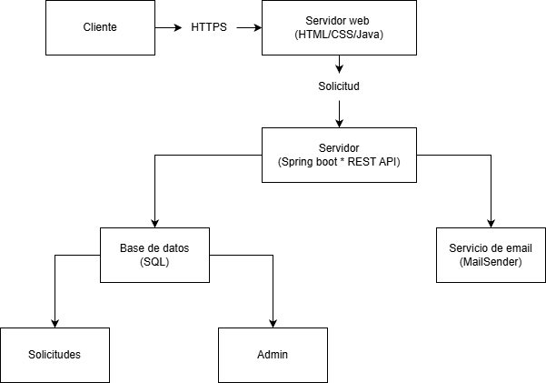

# Entre Trazo — Sistema de Cotizaciones y Citas

## Resumen ejecutivo

### Descripción
Este repositorio contiene la solución para el sistema web de cotizaciones y citas de Entre Trazo. 
Su propósito es permitir a los clientes solicitar cotizaciones y agendar citas de forma eficiente, y al administrador gestionar y dar seguimiento a cada solicitud desde un panel privado.

### Problema identificado
Actualmente, la gestión de solicitudes se realiza por teléfono y WhatsApp, lo que provoca:
- Pérdida de solicitudes sin registro formal
- Falta de seguimiento a cotizaciones
- Conflictos de horario en citas
- Baja trazabilidad del proceso

### Solución
Plataforma web que permite:
- Recibir solicitudes de cotización y citas en línea
- Centralizar la información en una base de datos
- Notificar automáticamente al cliente y al administrador
- Gestionar el estado de cada solicitud desde un panel administrativo

### Arquitectura
- **Frontend:** HTML, CSS, JavaScript
- **Backend / API:** Java, Spring Boot
- **Base de datos:** MySQL
- **Infraestructura:** Railway / Render
- **CI/CD:** GitHub Actions



---

## Tabla de contenidos
- [Resumen ejecutivo](#resumen-ejecutivo)
- [Requerimientos](#requerimientos)
- [Instalación](#instalación)
- [Configuración](#configuración)
- [Uso](#uso)
- [Contribución](#contribución)
- [Roadmap](#roadmap)
- [Wiki](https://github.com/Veloz2/Entre_Trazo/wiki)
---

## Requerimientos

### Infraestructura
- Servidor de aplicación: Spring Boot (embebido Tomcat)
- Servidor web: no aplica (archivos estáticos servidos por Spring Boot)
- Base de datos: MySQL 8.0
- Sistema operativo recomendado: Ubuntu / Windows / macOS

### Software y dependencias
- Java: 21
- Maven: 3.9+
- Git: 2.x+

### Paquetes adicionales
- spring-boot-starter-web
- spring-boot-starter-data-jpa
- spring-boot-starter-validation
- spring-boot-starter-mail
- mysql-connector-j
- lombok

---

## Instalación

### Clonar repositorio
```bash
git clone https://github.com/Veloz2/Entre_Trazo.git
cd Entre_Trazo
```

### Variables de entorno
Crea un archivo `.env` basado en `.env.example`:
```
DB_URL=jdbc:mysql://localhost:3306/entretrazo
DB_USER=root
DB_PASSWORD=tu_password
MAIL_USER=tucorreo@gmail.com
MAIL_PASSWORD=tu_app_password
```

### Instalar dependencias
```bash
./mvnw clean install
```

### Ejecutar ambiente de desarrollo
```bash
./mvnw spring-boot:run
```

### Crear la base de datos
```bash
mysql -u root -p < docs/schema.sql
```

---

## Configuración

### Archivos principales
- `src/main/resources/application.properties`
- `.env`
- `docs/schema.sql`

### Ejemplo `application.properties`
```properties
server.port=8080
spring.datasource.url=${DB_URL}
spring.datasource.username=${DB_USER}
spring.datasource.password=${DB_PASSWORD}
spring.jpa.hibernate.ddl-auto=update
spring.jpa.show-sql=true
```

### Validaciones previas
- [ ] Base de datos `entretrazo` creada en MySQL
- [ ] Variables de entorno configuradas en `.env`
- [ ] Puerto 8080 disponible
- [ ] Java 21 instalado (`java -version`)

---

## Pruebas

### Pruebas manuales
1. Iniciar la aplicación con `./mvnw spring-boot:run`
2. Abrir `frontend/index.html` en el navegador
3. Llenar el formulario con datos válidos y verificar que se guarda en la BD
4. Intentar enviar con campos vacíos y verificar que muestra errores
5. Acceder al panel admin en `http://localhost:8080/admin`
6. Verificar cambio de estado de solicitudes

### Pruebas automatizadas
```bash
./mvnw test
```

---

## Despliegue

### Producción local
```bash
./mvnw clean package
java -jar target/entretrazo-0.0.1-SNAPSHOT.jar
```

### Railway / Render
1. Conectar el repositorio de GitHub
2. Configurar variables de entorno en el dashboard
3. El despliegue ocurre automáticamente en cada push a `master`

---

## Uso

### Usuario final (cliente)
El cliente puede:
- Acceder al formulario público sin necesidad de registro
- Solicitar una cotización o agendar una cita
- Recibir confirmación por email

### Usuario administrador
El administrador puede:
- Iniciar sesión en el panel privado
- Ver y filtrar todas las solicitudes
- Cambiar el estado de cada solicitud (pendiente / atendido / cancelado)
- Agregar notas internas
- Exportar el listado en CSV

---

## Contribución

### 1. Clonar repositorio
```bash
git clone https://github.com/Veloz2/Entre_Trazo.git
cd Entre_Trazo
```

### 2. Crear nueva rama
```bash
git checkout -b feature/nombre-cambio
```

### 3. Guardar cambios
```bash
git add .
git commit -m "feat: descripción breve del cambio"
```

### 4. Subir rama
```bash
git push origin feature/nombre-cambio
```

### 5. Enviar Pull Request
- Abrir un Pull Request hacia `master`
- Describir claramente el objetivo
- Adjuntar evidencia si aplica

### 6. Esperar revisión y merge
- Atender comentarios
- Realizar ajustes
- Hacer merge al aprobarse

---

## Roadmap
- [ ] Notificaciones por correo al cliente y admin
- [ ] Panel de métricas y reportes
- [ ] Exportación avanzada de reportes
- [ ] CI/CD con GitHub Actions
- [ ] Autenticación con sesión segura (BCrypt)
- [ ] Cobertura de pruebas > 80%
- [ ] Galería de proyectos / renders
- [ ] Soporte para adjuntos en formulario

---

**Proyecto integrador — Tecmilenio 2025**  
Desarrollado por: Jose Daniel Diaz Veloz  
Empresa: Entre Trazo (constructora familiar)  
Stack: Java Spring Boot · MySQL · HTML/CSS/JS
